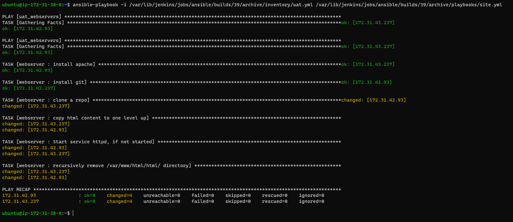

## Refactor ansible code by importing other playbooks into site.yml


**Step 1 - Jenkins job enhancement**

-  I created a directory in my **Ansible-jenkins** server called **ansible-config-artifact**


-  I changed permissions to this directory using **chmod -R 0777 /home/ubuntu/ansible-config-artifact**, so Jenkins could save files there. I also changed permission on the parents directory /home/ubuntu and added jenkins to ubuntu user. 

-  In jenkins web console, i searched for **copy artifact** plugin and downloaded it. 


-  I created a freestyle project called **save_artifacts** and configured the build steps to copy artifact from from my Ansible project to my newly created folder **ansible-config-artifact**


- I made change to my readme.md folder to confirm that that my build step in **save-artifact** project will be trigared and copy artifact to **ansible-config-artifact** folder


- I also confirmed that the artifact was copied to my **ansible-config-artifact** folder


## Step 2 - Refactor Ansible code by importing other playbooks into site.yml

-  I created a new branch in my ansible-config-mgt called refactor 

  


  -  i created a file in my playbook called site.yml and also created a folder called **static-assignment** in my root folder. I moved common.yml to my **static-assigmnet** folder and then inported **common.yml** playbook into **site.yml**.

  


  -  Run **ansible-playbook command** against the dev environment

  I created a folder called del-common.yml and updated site.yml with it to delete wireshak in my servers 


-  I ran the playbook to delete wireshark  as **ubuntu@ip-172-31-94-81:~/ansible-config-artifact$ ansible-playbook -i inventory/dev.yml playbooks/site.yml**  and it was successful 


-  I also ssh into my 4 servers to confirm wireshak was deleted.


## Configure uat webservers with a role webserver


## Step 3 - Configure UAT Webservers with a role 'Webserver'

 - I spined up 2 rhel 8 instances in aws called web1 and web2


  
-  Using **ansible-galaxy init webserver**, i created a role called webserver 

``````
└── webserver
    ├── README.md
    ├── defaults
    │   └── main.yml
    ├── handlers
    │   └── main.yml
    ├── meta
    │   └── main.yml
    ├── tasks
    │   └── main.yml
    └── templates
``````
4. we will Update our inventory ansible-config-mgt/inventory/uat.yml file with IP addresses of our 2 UAT Web servers

``````
[uat-webservers]
<Web1-UAT-Server-Private-IP-Address> ansible_ssh_user='ec2-user' 

<Web2-UAT-Server-Private-IP-Address> ansible_ssh_user='ec2-user' 
``````

5. In /etc/ansible/ansible.cfg file let us uncomment roles_path string and provide a full path to our roles directory roles_path    = /home/ubuntu/ansible-config-artifact/roles, so Ansible could know where to find configured roles.

6. In our webser role, in tasks folder, we will update the main.yml file as below.

``````
---
- name: install apache
  become: true
  ansible.builtin.yum:
    name: "httpd"
    state: present

- name: install git
  become: true
  ansible.builtin.yum:
    name: "git"
    state: present

- name: clone a repo
  become: true
  ansible.builtin.git:
    repo: https://github.com/<your-name>/tooling.git
    dest: /var/www/html
    force: yes

- name: copy html content to one level up
  become: true
  command: cp -r /var/www/html/html/ /var/www/

- name: Start service httpd, if not started
  become: true
  ansible.builtin.service:
    name: httpd
    state: started

- name: recursively remove /var/www/html/html/ directory
  become: true
  ansible.builtin.file:
    path: /var/www/html/html
    state: absent
``````

7. The code above will 
- Install and configure Apache (httpd service)
- Clone Tooling website from GitHub https://github.com/darey-io/tooling.git
- Ensure the tooling website code is deployed to /var/www/html on each of 2 UAT Web servers.
- Make sure httpd service is started

**D-- REFERENCE 'WESERVER' ROLE**

1. Within the static-assignments folder, we will create a new assignment for uat-webservers uat-webservers.yml. This is where you will reference the role.

``````
---
- hosts: uat-webservers
  roles:
     - webserver
``````

2. The entry pint to our ansible configuration is the site.yml in playbook folder. Therefore we need to refer our uat-webserver.yml rolse inside site.yml as shown below.

``````
---
- hosts: all
- import_playbook: ../static-assignments/common.yml

- hosts: uat-webservers
- import_playbook: ../static-assignments/uat-webservers.yml
``````
 COMMIT AND TEST

Since we have been using a git branch called refator, we will commit our changes, create a pull request nd merge with the main branch. At the same time our webhook will trigger our jenkins jobs and update our artifacts in our server /home/ubuntu/ansible-config-artifact/.

1. Now let's run our playbook against our UAT inventory 

`sudo ansible-playbook -i /home/ubuntu/ansible-config-mgt/inventory/uat.yml /home/ubuntu/ansible-config-mgt/playbooks/site.yaml`

OR

`ansible-playbook -i /var/lib/jenkins/jobs/ansible/builds/39/archive/inventory/uat.yml /var/lib/jenkins/jobs/ansible/builds/39/archive/playbooks/site.yml`



2. We can now see both of your UAT Web servers configured and we will reach them on our web browser. 

http://ec2-16-171-6-172.eu-north-1.compute.amazonaws.com/index.php

or

http://ec2-16-171-162-222.eu-north-1.compute.amazonaws.com/index.php


3. Our Ansible architecture will now look like below.


